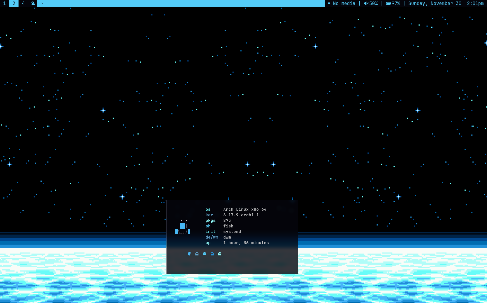
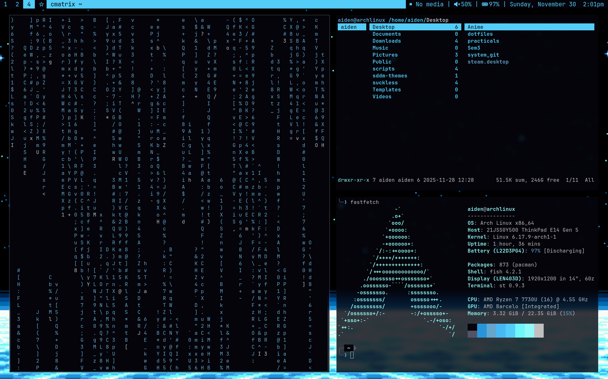

<h2 align="center">✨ My DWM Setup</h2>

---

## Screenshots

  
  

---

## What’s Included

- **dwm** (custom patched)
- **st** (custom build)
- **dwmblocks-async**
- Simple scripts for media, volume, battery, etc.
- A few useful configs maybe

Everything here is part of *my personal workflow*.  
Feel free to use anything as a **reference**, cloning it directly might not work on your setup.

---

## Notes

Statusbar scripts come from the work of **breadonpenguins**, **Luke Smith**, and **arkboi** — all credit to them. Their setups inspired me to use dwm and shape my system to my liking.

---

  ⭐ feel free to contribute !!!

